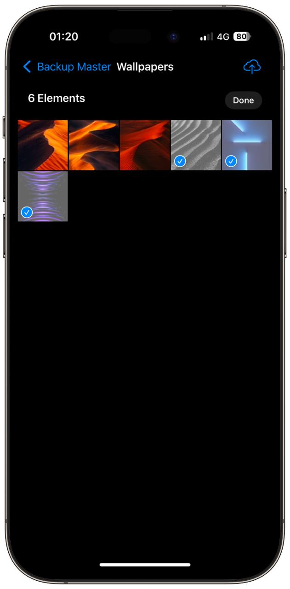

# BackupMaster (name may change in the future)

## Overview
**BackupMaster** is an iOS application designed to securely back up your photos to your pc or a remote server. This app allows you to easily and efficiently manage your photo backups.

 &nbsp;

 &nbsp;
 &nbsp;

---

## Features
- **Selective Backup**: Choose specific photos or albums to back up.
- **Server Compatibility**: Works with most WebDAV servers, including Nextcloud, ownCloud, and other compatible solutions. For the moment the application supports only webDav server but more servers will be added soon.

---

## Installation
1. Clone the repository to your local machine:
2. Open the project in Xcode.
3. Build and run the app on your device or simulator.

---

## Usage
1. Launch the app on your iOS device.
2. Add a server
3. Go in a album and press the upload button

Feel free to open an issue if you encounter any problems or have feature requests!
